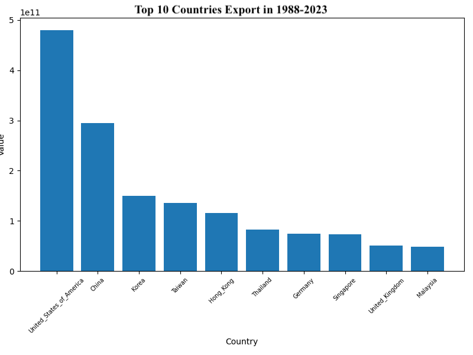
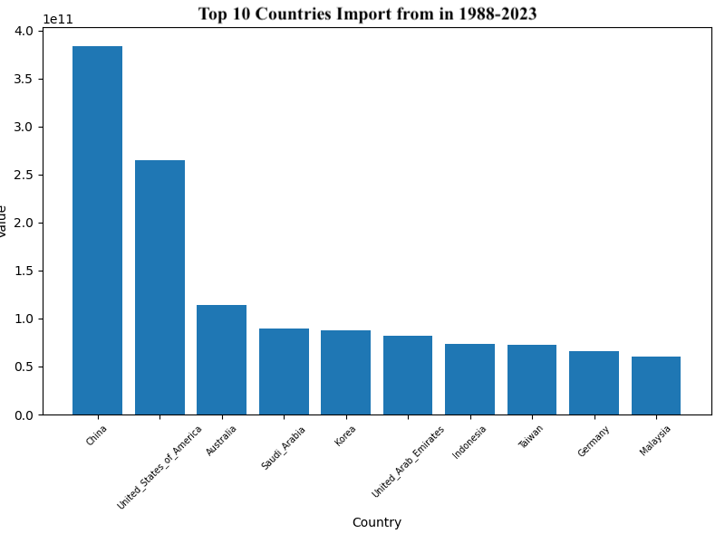

# Product level analysis of Japan's trade statistics

 As a part of MACS30123 Large-Scale Computing for the Social Sciences, this personal project works on 
 Japanese Trade Statistics and conducts 
 Big Data analysis with Data Visualization and Regression. 
 
## Social science research problem

Determining the factors that influence trade flows has been a prominent area of study in international financial literature (refer to [1] for an overview). One specific aspect that has garnered significant attention is the exchange rate elasticity of trade balance. Understanding this elasticity is crucial as countries often focus on currency devaluation as a means to improve their trade balance. However, empirical studies examining the J-curve effect hypothesis, which explores the trade response to devaluation in both the short and long term, have produced mixed results (refer to [2] for a review of the J-curve effect).

One of the reasons for these inconsistent findings is the reliance on aggregate export or import data in many studies. To address this issue, Bahmani-Oskooee has conducted several studies using country-specific trade data or product-level data (e.g., [3,4]). This approach allows for a more nuanced understanding of the heterogeneous effects of exchange rates.

Furthermore, the integration of the global value chain (GVC) in recent years has significantly altered the trade flow response to exchange rates. For instance, Japanese manufacturers began relocating their operations abroad during the 1990s, reducing their vulnerability to exchange rate fluctuations [5].

Building upon Bahmani-Oskooee's methodology, the objective of our study is to analyze the exchange rate elasticities at the product level using up-to-date data and detailed bicountry and product level Japanese data. 

## Justification of the importance of using scalable computing methods

Obtaining access to detailed and granular trade statistics data from the Japanese government presents a valuable opportunity for our research. The availability of monthly data at such a high level of granularity, encompassing all trading partners and product codes for imports and exports, provides us with a comprehensive dataset. However, it is important to note that this level of granularity also results in a large dataset, with a total of 51,291,956 records. 

While it may be tempting to rely on more aggregated data to simplify the analysis, doing so would lead to a loss of crucial information and subsequently reduce the precision of our estimates. To ensure that we extract the maximum insights and preserve the accuracy of our findings, it is imperative to employ large-scale computing methods throughout our research process. 

## Dataset
 
* Trade Statistics

  Update Kaggle dataset with recent data. Monthly level data from 1988-2020 and most granular product level ([HS9 codes](https://www.trade.gov/harmonized-system-hs-codes)). 
    * [Kaggle 1988-2020](https://www.kaggle.com/datasets/zanjibar/100-million-data-csv)
    * [E-Stat](https://www.e-stat.go.jp/en/stat-search/files?page=1&toukei=00350300&tstat=000001013141): scarped with [API](https://www.e-stat.go.jp/api/en)
* Exchange Rates

  Downloaded monthly data of "National Currency Per U.S. Dollar, Period Average Rate" from [IMF](https://data.imf.org/?sk=4c514d48-b6ba-49ed-8ab9-52b0c1a0179b&sId=1390030341854). Eventually converted to National Currency Per Japan Yen in our analysis. 
  
* GDP

  Downloaded quarterly data of "Nominal, Domestic Currency, Seasonally Adjusted GDP" from [IMF](https://data.imf.org/?sk=4c514d48-b6ba-49ed-8ab9-52b0c1a0179b&sId=1390030341854). 
  
Since their is a mismatch between country codes between trade dataset and IMF dataset, we used `fuzzywuzzy' to match country names and then manually modify some mismatch.  

## Model

We run Panel ARDL model with statsmodels package. Particulary, [Panel OLS](https://bashtage.github.io/linearmodels/panel/panel/linearmodels.panel.model.PanelOLS.html) is used based on [3] and [4], which can be described as following. 

$$
\begin{align}
\Delta\log(Y_{i,c,t}) &= \delta_0 + \lambda_0\log(Y_{c,t-1})+\lambda_1\log(EX_{c,t-1})+\lambda_2\log(GDP_{c, t-1})\\
&+\sum_{j=1}^3\phi_j\Delta\log(Y_{t-j})+\sum_{j=0}^3\rho_j\Delta\log(EX_{t-j})+\sum_{j=0}^3\eta_j\Delta\log(GDP_{t-j})\\
&+\alpha country_c+\beta time_t+ \varepsilon_{c,t}
\end{align}
$$

The subscript $i$ is for product, $c$ is for country, and $t$ is for time. $Y$ is the value of trade flows of export and import respectively. $EX$ is exchange rate (Domestic Currency/Japan Yen). $GDP$ in the first equation is trading's partner GDP. $country$ is for entity fixed effect and $time$ is for time fixed effect. Our dataset contains 88 unique hs2 codes so that we run 176 regressions. The time period is 1988Q1-2023Q1. Missing value is droped. 

We are interested in exchange rate elasticities. We can derive short and long-run coefficients following [3] and [4]. 

$$
\begin{align}
\text{short-run coefficients}&: \frac{\rho_j}{\phi_j}\quad(j=1,2,3)\\
\text{long-run coefficient}&: \frac{\lambda_1}{\lambda_0}
\end{align}
$$

## Pipelines
* Scraping of recent trade statistics: [scraping.ipynb](https://github.com/macs30123-s23/final-project-ayako/blob/main/scraping.ipynb)

    * This is done in local and not parallelize due to API's limitation. 
  
* Upload data to S3: [upload_data.ipynb](https://github.com/macs30123-s23/final-project-ayako/blob/main/upload_data.ipynb)

    * Upload raw data files to S3. Some manipulation is done for small data (IMF's exchange rate and GDP data). 

* Processing trade data with pyspark: [data_manipulation_pyspark.ipynb](https://github.com/macs30123-s23/final-project-ayako/blob/main/data_manipulation_pyspark.ipynb)

    * Process old data from Kaggle and new data we scraped so that can be merged later. 
    * We chose PySpark because it was impossible to handle large data with memory issue in our local environment. We also tried Dask but PySpark was a 
      lot faster to do basic data manipulation. We configure PySpark environment as follows. 

    ```
    aws emr create-cluster \
    --name "Spark Cluster" \
    --release-label "emr-6.2.0" \
    --applications Name=Hadoop Name=Hive Name=JupyterEnterpriseGateway Name=JupyterHub Name=Livy Name=Pig Name=Spark Name=Tez \
    --instance-type m5.xlarge \
    --instance-count 6 \
    --use-default-roles \
    --region us-east-1 \
    --ec2-attributes '{"KeyName": "vockey"}' \
    --configurations '[{"Classification": "jupyter-s3-conf", "Properties": {"s3.persistence.enabled": "true", "s3.persistence.bucket": "trade-final-project-bucket"}}]'
    ```

* EDA with pyspark: [EDA_pyspark.ipynb](https://github.com/macs30123-s23/final-project-ayako/blob/main/EDA_pyspark.ipynb)

    * Merge old data from Kaggle and new data we scraped. 
    * Add country and HS code information. 
    * Data Visualization. 
    * Similarly used Pyspark to work on large dataset. 

* Prepare data for ARDL analysis with pyspark: [data_manipulation_ARDL_pyspark.ipynb](https://github.com/macs30123-s23/final-project-ayako/blob/main/data_manipulation_ARDL_pyspark.ipynb)

    * Merge trade data with exchange rate data (monthly data). 
    * Aggregate monthly data to quarterly data and hs9 codes to hs2 codes. Sum export value and average exchange rate. 
    * Merge quarterly data with GDP data. 
    * Change numerical data to log base. 
    * Add lag and difference variables. 
    * Similarly used Pyspark to work on large dataset. 

* Run ARDL with Dask: [ARDL_dask.ipynb](https://github.com/macs30123-s23/final-project-ayako/blob/main/ARDL_dask.ipynb)

    * Run multiple ARDL regression for import and export for all hs2 codes. 
    * Extract model summary and calculate coefficients. 
    * Use Dask because ARDL model is available in latest statsmodels library and we could not install to Pysark. We configure Dask environment as follows where bootstrap code is stored [here](https://github.com/macs30123-s23/final-project-ayako/blob/main/bootstrap). 

   ```
   aws emr create-cluster --name "Dask-Cluster" \
    --release-label emr-6.2.0 \
    --applications Name=Hadoop \
    --instance-type m5.xlarge \
    --instance-count 6 \
    --bootstrap-actions Path=s3://trade-final-project-bucket/bootstrap \
    --use-default-roles \
    --region us-east-1 \
    --ec2-attributes '{"KeyName":"vockey"}'
   ```

## Results

### EDA
First, we conduct some basic data visualization to check the data is properly collected. 

1. Top 10 trading partners

    * The U.S. and China are the major trading partner in both export and import. 
    * Japan exports to many asian countries (China, Korea, Taiwan, Hong Kong, Thailand, Singapore, and Malaysia), while it imports from resource-rich countries (United States, Australia, Saudi Arabia, and United Arab Emirates)  
<p align="center">
  
</p>

<p align="center">
  
</p>

2. Time series of trade flows value in Top 10 trading partners

    * The trades with China have grown rapidly. 
    * The U.S. has been a stable trading partner over the year. 
    * Large drops in trade value are observed around 2009 and 2020 due to crises. 
<p align="center">
  
</p>

<p align="center">
  
</p>

3. Time series of top 10 products in HScode basis. 

    * HS2 code 84, 85 and 87 (see legend for detail) show similar trend in export value. 
    * Mineral fuel is the major imported product. However, the trade flow is volatile. 
    * Some HS2 codes are common between export and import (29, 84, 85, 87, and 90). Probably this is because of GVC. 
<p align="center">
  
</p>

<p align="center">
  
</p>

<sub>Upper graph<br>84:Machines, 90: Optical photographic cinematographic measuring checking precision medical or surgicalinstruments and apparatus; parts and accessories thereof, 29: Organic chemicals, 39: Plastics and articles thereof, 19: Preparations of cereals flour starch or milk; pastrycooks'products, 85: Electrical machinery and equipment and parts thereof; sound recorders and reproducers  television image and sound recorders and reproducers and parts and accessories of such articles, 87: Aircraft spacecraft and parts thereof, 72: Iron and steel, 73: Articles of iron or steel, 89: Ships boats and floating structures</sub>

<sub>Lower graph<br>27: Mineral fuels mineral oils and products of their distillation; bituminous substances; mineral waxes, 90: Optical  photographic  cinematographic  measuring  checking  precision  medical or surgical instruments and apparatus; parts and accessories thereof, 29: Organic chemicals, 84: Machines, 44: Wood and articles of wood; wood charcoal, 26: Ores slag and ash, 87: Vehicles other than railway or tramway rolling-stock  and parts and accessories thereof, 71: Natural or cultured pearls  precious or semi-precious stones  precious metals  metals clad with precious metal and articles thereof; imitation jewellery; coin, 85: Electrical machinery and equipment and parts thereof; sound recorders and reproducers  television image and sound recorders and reproducers  and parts and accessories of such articles, 30: Pharmaceutical products.</sub>

### ARDL results

The estimation results of ARDL models are shown below. The export table are sorted by long-term coefficient in ascending order. Theoritically, if the Japan's currency devaluate, the import should increase in long-term. In our model, the exchange rate is defined as trading partner's currency/Japan Yen, the coefficients should be negative if the hypothesis is true. However, the number of products that have negative coefficients is less than positive ones. For major products mentioned in data visualization, 72, 84, and 90 have a positive value, and other coefficients are insignificant. We also observe the absolute values of coefficients are less than [3] with the U.S. Furthermore, this is consistent with [5] where trade elastistity is becoming less significant. 

<p align="center">
  <figcaption>Export Results</figcaption>
  
</p>

<p align="center">
  <figcaption>Import Results</figcaption>
  
</p>


## Disscussion and Conclusion


## References

[1] Krugman, P., Obstfeld, M., Melitz, M. 2018. International Economics: Theory and Policy. Pearson Education Limited. 

[2] Bahmani-Oskooee, M., and Ratha, A. 2004. The J-curve：a literature review. Applied economics, 36(13), 1377–1398.

[3] Bahmani-Oskooee, Mohsen, and Zohre Ardalani. 2006. Exchange Rate Sensitivity of U.S. Trade Flows: Evidence from Industry Data. Southern Economic Journal 72, no. 3 (2006): 542–59. 

[4] Bahmani-Oskooee, M., & Aftab, M. 2017. On the asymmetric effects of exchange rate volatility on trade flows: New evidence from US-Malaysia trade at the industry level. Economic Modelling, 63, 86-103.

[5] Shimizu, J., Sato, K. 2015. Abenomics, Yen Depreciation, Trade Deficit, and Export Competitiveness. RIETI Discussion Paper,15-E-020. 
